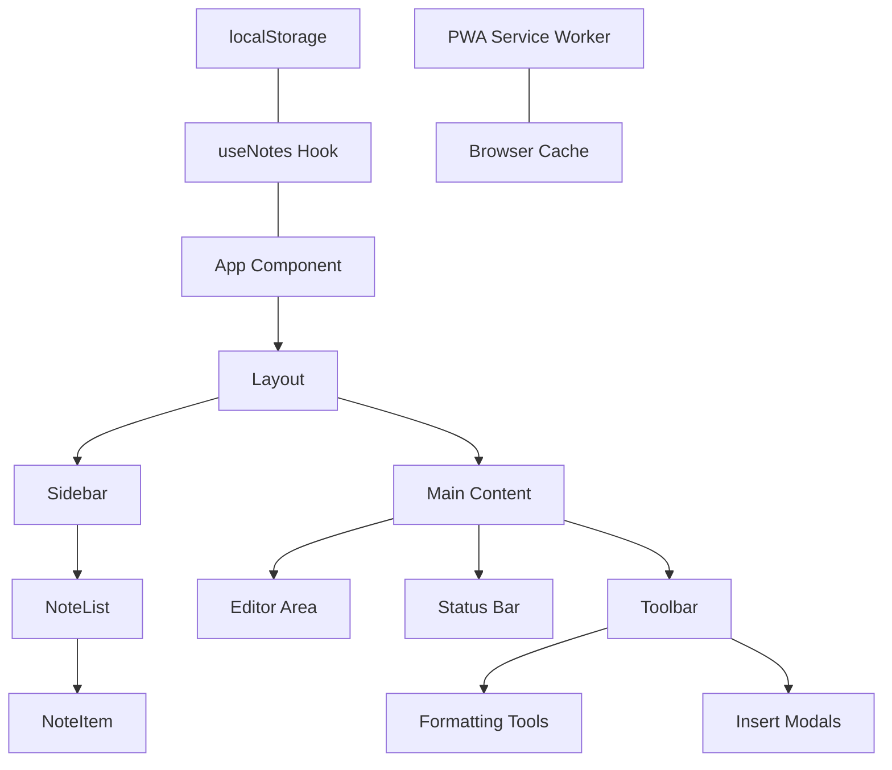

# Feature Implementation Plan: KnexByte Editor PWA Conversion

## Feature Overview
**Feature Name:** KnexByte Editor PWA

**Brief Description:** 
Convert the existing `knexbyte-editor.jsx` into a full-scale React application using TypeScript and Vite, with Progressive Web App (PWA) capabilities for offline use and installation.

**Business Goal:**
Provide a robust, installable, and modern text editor experience that users can use as a standalone application on mobile and desktop.

**Target Users:**
Professionals, developers, and note-takers who need a clean, distraction-free environment for writing and code snippets.

## Feature Requirements

### User Stories
1. **As a writer**, I want to use the editor offline so that I can continue working without an internet connection.
2. **As a power user**, I want to install the editor as a desktop/mobile app for quick access.
3. **As a developer**, I want a maintainable and typed codebase so that I can easily extend or debug the editor.

### Functional Requirements
#### Core Functionality
1. **Note Management**: Create, load, and delete notes.
2. **Rich Text Editing**: Formatting (Bold, Italic, Headings, etc.), Tables, and Code Blocks.
3. **Persistence**: Save notes to `localStorage`.
4. **Export**: Save notes as standalone HTML files.
5. **PWA Support**: Offline caching and manifest for installation.

#### User Interface Requirements
1. **Responsive Design**: Sidebar for navigation, main editor area.
2. **Dark Mode**: Premium "GitHub-like" aesthetics as seen in the original JSX.
3. **PWA Prompts**: Indication if the app is ready for offline use or installation.

#### Business Logic Requirements
1. **Auto-save**: Notes should save automatically after a short period of inactivity.
2. **Data Consistency**: Ensure `localStorage` is handled defensively to prevent data loss.

#### Data Requirements
1. **Note Object Schema**: `id`, `title`, `content`, `date`.
2. **Settings Persistence**: Store user preferences like font choice.

## Implementation Plan

### Phase 1: Setup & Project Scaffolding
- Initialize Vite + React + TypeScript in the current directory.
- Install dependencies: `vite-plugin-pwa`, `lucide-react`, `clsx`, `tailwind-merge`.
- Configure PWA manifest and service worker.

### Phase 2: Architecture & Refactoring (TypeScript)
- Define `types/` for Note, Editor Fonts, and App State.
- Create `constants/` for colors, font options, and default values.
- Extract components into `src/components/`:
  - `Layout`: Shared layout structure.
  - `Sidebar`: Note list and search.
  - `Toolbar`: Formatting tools.
  - `NoteEditor`: The main content-editable area.
  - `Modals`: Table and Code Block insertion.
- Implement custom hooks in `src/hooks/`:
  - `useNotes`: Logic for managing notes in `localStorage`.
  - `useEditor`: Logic for formatting commands and stats.

### Phase 3: PWA Implementation
- Configure `vite-plugin-pwa` with icons, theme colors, and offline strategy.
- Generate high-quality assets (favicon, 192/512 icons).

### Phase 4: Styling & Polish
- Move inline styles to Vanilla CSS (CSS Modules or Global CSS).
- Add micro-animations (hover effects, transitions).

## Mermaid Diagram

## Files to be Created/Modified
- `src/main.tsx`: Entry point.
- `src/App.tsx`: Main container.
- `src/components/`: Component library.
- `src/hooks/`: Business logic.
- `src/constants/`: Configuration and theme.
- `src/types/`: TypeScript definitions.
- `src/styles/`: Vanilla CSS.
- `vite.config.ts`: Vite and PWA config.
- `public/manifest.json`: PWA metadata.

## Integration Points
- **Frontend-LocalStorage**: Synchronizing react state with browser storage.
- **Service Worker**: Intercepting network requests for offline support.
